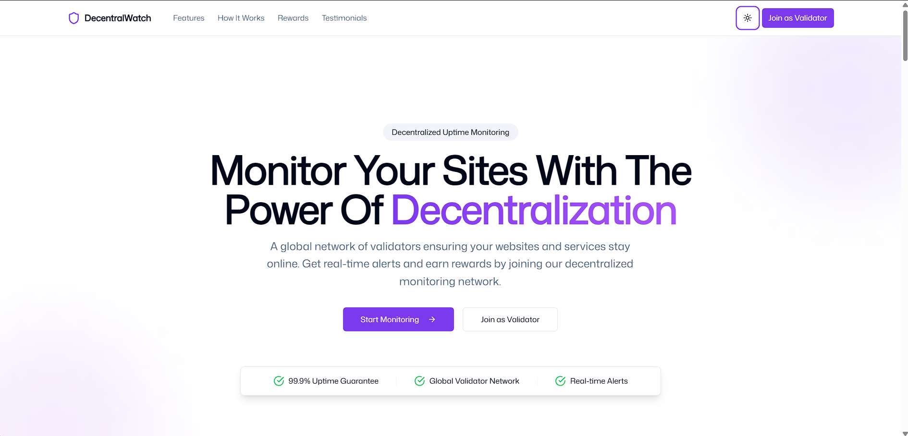

# 🌐 DecentralWatch

DecentralWatch is a **decentralized uptime monitoring platform** where validators across the globe report website uptime and get incentivized for their contributions. Say goodbye to centralized monitoring failures - DecentralWatch ensures a **trustless, transparent, and community-driven** approach to website reliability.

## 🚀 Features

- **Decentralized Uptime Monitoring** – Validators verify website status from different locations.
- **Incentivized Network** – Participants earn rewards for accurate uptime reports.
- **Real-Time Insights** – Get instant alerts and analytics on website uptime.
- **Trustless & Transparent** – No central authority; all data is verifiable.
- **Dark/Light Mode** – Sleek and professional UI with interactive elements.

## 🎯 How It Works

1. **Run a Validator** – Users can set up a validator node to monitor websites.
2. **Report Uptime** – Validators continuously check website availability.
3. **Earn Rewards** – Get incentivized for honest and accurate reporting.
4. **View Analytics** – Website owners get real-time insights and alerts.

## 📸 Screenshots

<!--  -->

## 🛠️ Tech Stack

- **Frontend:** Next.js, TypeScript, Tailwind CSS
- **Backend:** Node.js, Express, PostgreSQL
- **Blockchain:** Solana
- **Storage:** IPFS / Decentralized Databases
- **Real-Time:** WebSockets

## 📬 Stay Connected

- Website: [kalehub.com](https://decentralwatch.kalehub.com)
- Twitter: [@PratikKale26](https://x.com/pratikkale26)
- LinkedIn: [Pratik Kale](https://www.linkedin.com/in/pratikkale26/)

---

**Empowering the Internet with Decentralization. Monitor. Validate. Earn.**
